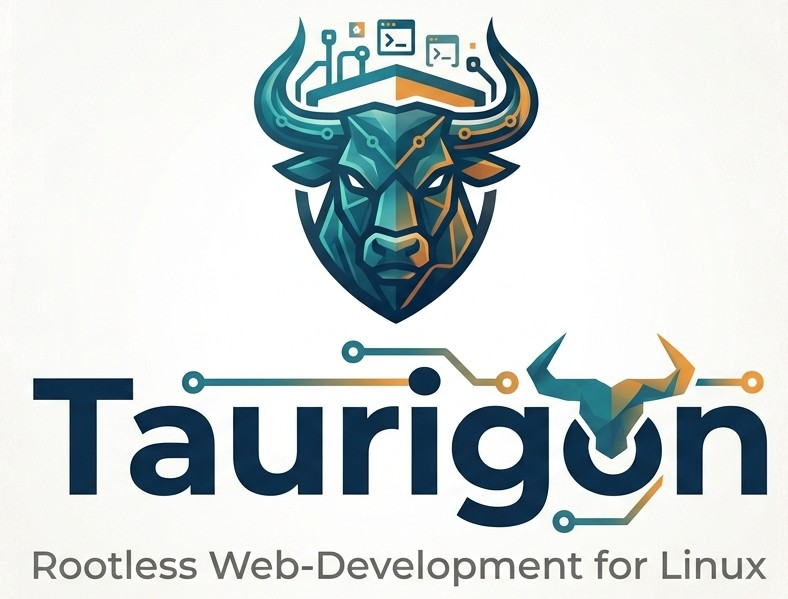

<div align="center">



Eine moderne GUI zur Verwaltung containerbasierter Entwicklungsumgebungen –
inspiriert von Laragon, gebaut für Linux, ohne Root-Rechte.

[]()
[]()
[]()

</div>

---

## ✨ Was ist Taurigon?

Taurigon vereinfacht die Verwaltung lokaler Webentwicklungsumgebungen unter
Linux. Statt Dienste mühsam per `systemctl` und Root-Rechten zu jonglieren,
laufen alle Dienste als **rootless Container** (Podman/Docker) – gesteuert über
eine aufgeräumte grafische Oberfläche.

### Kernphilosophie

- 🔒 **Rootless first** – so wenig Rechte wie möglich, kein `sudo` für den Alltag
- 📦 **Container statt Systemdienste** – reproduzierbar, isoliert, sauber
- 🎯 **`.localhost`-Domains** – ohne `/etc/hosts`-Gefummel
- ⚡ **Nativ & schnell** – Rust-Backend, winzige Binary

---

## 🚀 Features

### ✅ Bereits verfügbar

- **Systemerkennung** – Container-Engine (Podman/Docker), Distribution,
  SELinux-Status, Rootless-Fähigkeit
- **Dienstverwaltung** – MariaDB, PostgreSQL, Redis: starten, stoppen,
  neustarten, entfernen – alles per Klick
- **Status-Monitoring** – farbige Live-Indikatoren, Port-Anzeige
- **Datenpersistenz** – Volumes überleben Container-Neustarts
- **Projektverwaltung** – PHP-/statische Projekte anlegen, im Editor öffnen
- **Moderne UI** – Dark/Light-Theme, wählbare Akzentfarben, Vektor-Icons

### 🚧 In Arbeit / Geplant

- Nginx-Reverse-Proxy für `.localhost`-Domains
- PHP-FPM-Container (Versionen 8.2 / 8.3 / 8.4, geteilt)
- SSL-Zertifikate via mkcert
- Datenbank-Wizard (DB + Benutzer anlegen)
- Integriertes Terminal mit Projektkontext

👉 Vollständige Planung in der [Roadmap](docs/ROADMAP.md).

---

## 📋 Voraussetzungen

| Komponente | Empfehlung | Hinweis |
|---|---|---|
| **OS** | Arch / CachyOS / Fedora | Debian später |
| **Container-Engine** | Podman (rootless) | Docker als Fallback |
| **Podman-Setup** | rootless konfiguriert | `subuid`/`subgid` gesetzt |

> 💡 Podman wird empfohlen, da es standardmäßig rootless und damit sicherer
> läuft. Docker funktioniert, benötigt aber meist die `docker`-Gruppe
> (root-äquivalent).

---

## 🏁 Quick Start

```bash
# Repository klonen
git clone https://github.com/<user>/taurigon.git
cd taurigon

# Frontend-Dependencies installieren
bun install

# App im Entwicklungsmodus starten
bun run tauri dev
